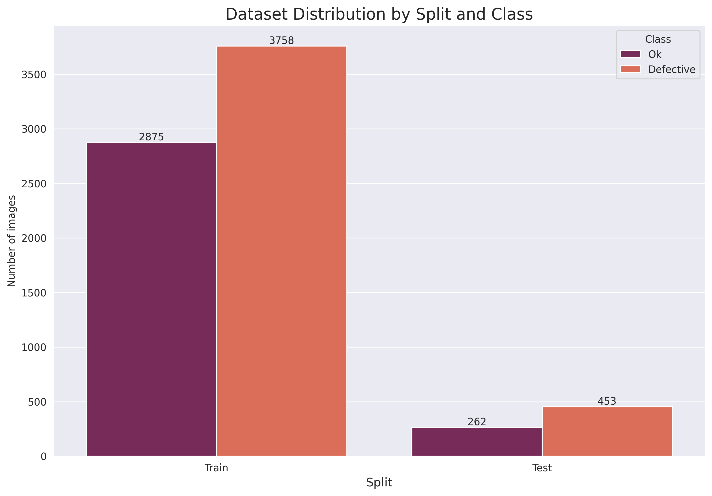
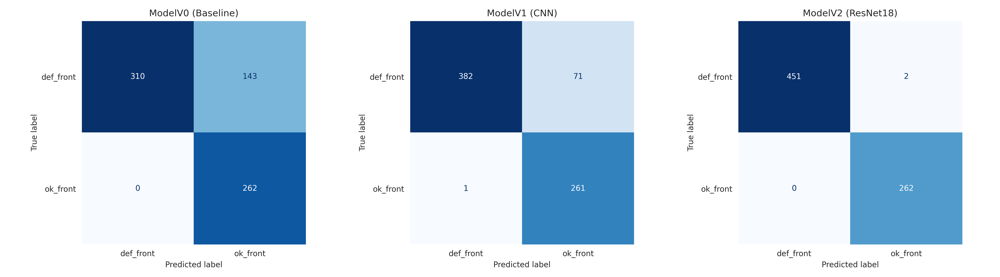

# 🛠️ AI-Powered Quality Control for Casting Products
#### This projekt demonstrates the classification of industrial casting parts using Deep Learning. The primary goal is to automate the quality assurance process by distinguishing between **defect-free parts(OK)** and **defective parts (DEFECT)**.

## 🚀 Project Overview
#### The project evaluates three diffrenet model architectures. The final implementation using '' archieved an accuracy of ''.

### Model Performance Comparison
| Model | Accuracy | Test Loss | Characteristics |
| :--- | :--- | :--- |:--- |
|**Baseline** | 80.57% | 0.2819  | Two linear layers with ReLU activation|
|**Custom CNN** | 90.22% | 0.2286 | Convolutional Neural Network optimized for 1-channel grayscale images|
|**ResNet18 (Transfer Learning)** | 99.73% | 0.0124 | Top-performing model utilizing pre-trained ImageNet weights|

## 🏗️ Model Architectures
### 1. Baseline Model
#### A basic feed-forward Multi-Layer Perceptron (MLP) used to establish a performance floor:
* **Two Linear Layers:** Mapping flattend pixel data to class probabilities.
*  **ReLU Activation:** Introduced between layers to handle non-linear relationships.
*   **Input:** Flattened 224x224 grayscale images.

### 2. Custom CNN
#### A deeper architecture designed to capture spatial features through:
* **Convolutional Layers:** For automatic feature extraction (edges, textures).
* **Max Pooling:** To reduce dimensionality and increase computation efficiency.

### 3. ResNet18
#### A Residual Network (ResNet18) adapted for this specific task:
* **Modified Input Layer:** Adjustied to accept 1-channel grayscale images (instead of 3-channel RGB).
* **Transfer Learning:** Fine-tuned from ImageNet pre-trained weights to leverage complex feature recognition.

## 📂Dataset Details
#### The modelwas trained and tested on a dataset of 1-channel grayscale images. The dataset is well-balanced, which is crucial for reliable classification results.

* **Total Dataset:** 7348 images.
    * **Defective (def_front):** 3758 images:
    *  **OK(ok_front):** 3590 images.
* **Data Split:** The data was divided into Training (approx. 90%) and Testing(approx. 10%) sets.

### Dataset Visualization
#### The following chart visualizes the distribution of the two classes ('def_front' and 'ok_front') across the training and testing splits. The balance between classes prevent model bias towards one category.

* **Original Resolution:** The images were originally **512x512** pixels.
* **Processed Resolution:** Resized to **224x224** pixels for optimal model performance.
* **Preprocessing:** Grayscale normalization and strategic padding to maintain structural edge details during convolution.

## 📊 Evaluation & Insights
#### A **Confusion Matrix** was generated to analyse the reliability of the classification across all three models, providing a detailed view of where each architecture succeeded or struggled.

### 1. Baseline Model Analysis
* **Observation:** The baseline matrix showed a high number of misclassifications, particularly confusing defective parts with OK parts (False Negatives).
* **Technical Cause:** Since this model flattens the 2D image into a 1D vector, it loses all spatial context. It cannot distinguish between a dark pixel caused by a shadow and one caused by a structural defect.
* **Industrial Risk:** High False Negative rates are unacceptable in production, as defective parts would reach the customer.

### 2. Custom CNN Analysis
* **Observation:** A significant reduction in errors compared to the baseline. The matrix showed better separation of classes.
* **Technical Cause:** The use of Convolutional Layers allowed the model to learn local patterns like edges and surface textures.
* **Industrial Risk:** It still struggled with subtle defects or variations in lighting, as the "shallow" architecture could not capture high-level semantic features.  

### 3. ResNet18 Analysis
* **Observation:** The matrix reveals near perfect performance, with only 3 misclassifications out of 715 samples.
* **Technical Cause:** By using Transfer Learning and Residual Connections, the model leverages complex features learned from millions of images. It effectively distinguishes between harmless surface reflections and actual material defects.
* **Industrial Risk:** With 100% precision on "OK" parts, the model ensures zero "False Alarms", which is crucial for maintaining a high production speed.

## 🛠️ Technical Stack
* **Language:** Python
* **Framework:** Pytorch, Torchvision
* **Data Processing:** Scikit_learn, Matplotlib, NumPy
* **Environment:** Google Colab /Jupyter Notebook

## Summary
This project demonstrates a systematic progression in model complexity for industrial quality control, evolving from a linear baseline to a high-precision architecture. By transitioning from a basic MLP (80.57% accuracy) to a Custom CNN (90.22%) and finally a ResNet18 (99.73%), the development process highlights how different architectures capture spatial features. The final model achieves the precision required for automated quality assurance, successfully identifying 712 out of 715 test images with a Test Loss of 0.0124. This benchmark underscores the effectiveness of leveraging pre-trained weights to meet the rigorous reliability standards of modern manufacturing.

